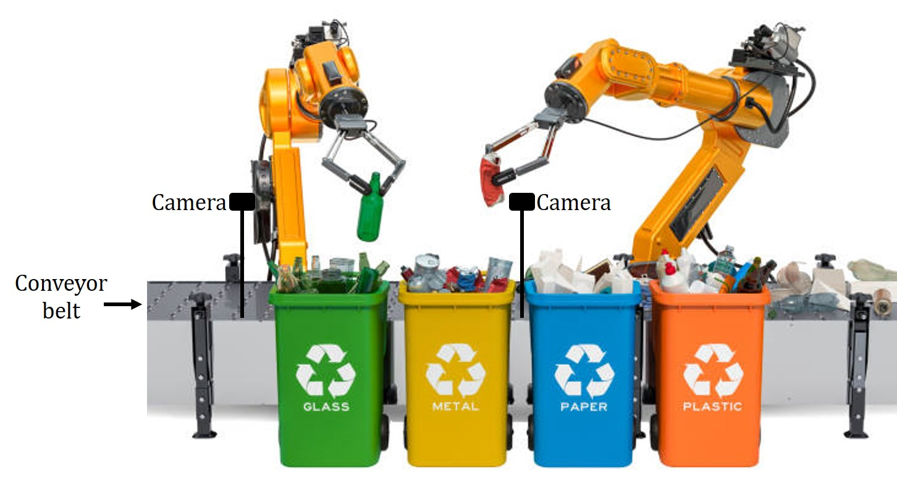
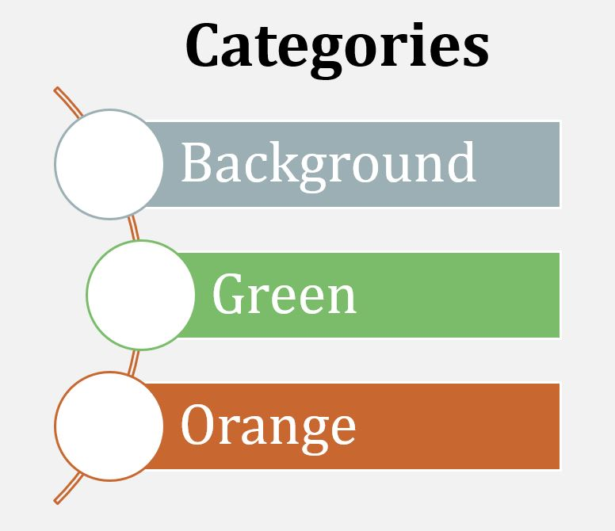
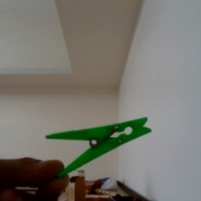
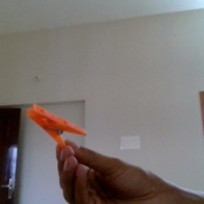
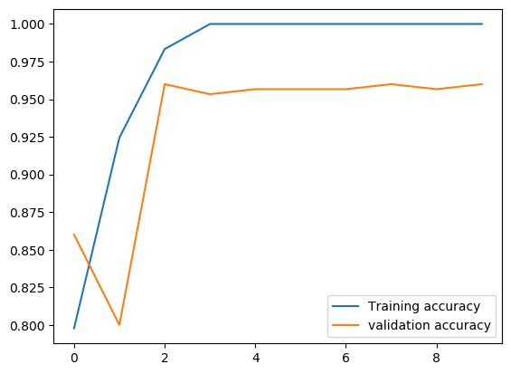
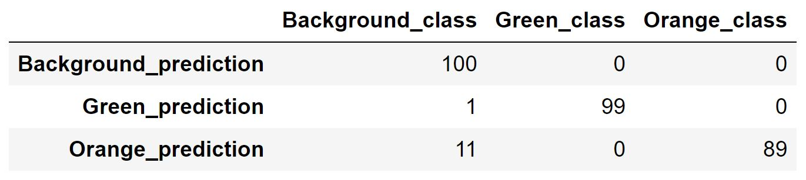
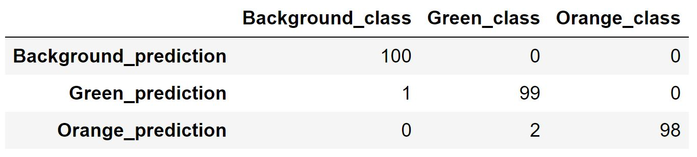
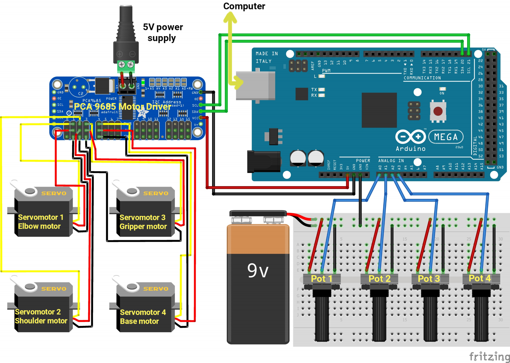

## Contents:
<ol>
   <li><a href="https://s-nithish-kumar.github.io/Colour_Sorting_with_Robot_Arm_using_Deep_Learning/#1-problem-statement">Problem Statement</a></li>
   <li><a href="https://s-nithish-kumar.github.io/Colour_Sorting_with_Robot_Arm_using_Deep_Learning/#2-objectives">Objectives</a></li>
   <li><a href="https://s-nithish-kumar.github.io/Colour_Sorting_with_Robot_Arm_using_Deep_Learning/#3-impact-of-solving-the-problem">Impact of Solving the Problem</a></li>
     <li><a href="https://s-nithish-kumar.github.io/Colour_Sorting_with_Robot_Arm_using_Deep_Learning/#4-proposed-approach">Proposed Approach</a></li>
     <li><a href="https://s-nithish-kumar.github.io/Colour_Sorting_with_Robot_Arm_using_Deep_Learning/#5-data-collection-and-preprocessing">Data Collection and Preprocessing</a></li>
   <li><a href="https://s-nithish-kumar.github.io/Colour_Sorting_with_Robot_Arm_using_Deep_Learning/#6-model-training">Model Training</a></li>
  <li><a href="https://s-nithish-kumar.github.io/Colour_Sorting_with_Robot_Arm_using_Deep_Learning/#7-model-testing-and-validation">Model Testing and Validation</a></li>
   <li><a href="https://s-nithish-kumar.github.io/Colour_Sorting_with_Robot_Arm_using_Deep_Learning/#8-implementation">Implementation</a></li>
   <li><a href="https://s-nithish-kumar.github.io/Colour_Sorting_with_Robot_Arm_using_Deep_Learning/#9-problems-and-troubleshooting">Problems and Troubleshooting</a></li>
   <li><a href="https://s-nithish-kumar.github.io/Colour_Sorting_with_Robot_Arm_using_Deep_Learning/#10-results-and-conclusion">Results and Conclusion</a></li>
   <li><a href="https://s-nithish-kumar.github.ioColour_Sorting_with_Robot_Arm_using_Deep_Learning/11-references">References</a></li>
</ol>

### 1. Problem Statement:
- Segregation of objects is a time consuming process and a mundane job.
+ In particular, Humans involved in waste segregation are exposed to harmful chemicals, which can lead to respiratory issues.

### 2. Objectives:
- Develop a color sorting system using a robot arm and classify the colors using a deep learning model.
+ This project acts as a base that can be modified for the segregation of other objects, especially waste, by training a Deep Learning model accordingly using a specific dataset.

### 3. Impact of Solving the Problem:
- Waste management involves the sight and smell of waste and working for extended periods under challenging conditions, which might lead to psychological problems contributing to stress, depression, and other mental health issues. Replacing humans with robots for such tasks can help overcome these problems.
+ Harmful chemicals affect humans and can cause respiratory problems, but robots are not affected by these chemicals.
+ Humans can work only for a limited duration, whereas robots can work 24/7 and perform more efficiently than humans.

### 4. Proposed approach:
The picture below shows the conceptual design of the project. Waste products placed on the conveyor belt move slowly. Multiple robots can be placed based on the quantity of waste that has to be segregated. For each robot, there will be a camera that classifies the type of waste. Once classified, the robot will pick up the waste and dispose of it in the appropriate trash can.

### 5. Data Collection and Preprocessing:
- Data is collected using a custom Python code that collects images of size 224 x 224 pixels.
- A total of 900 images were collected for three classes, with 300 images for each of the classes. For each category, 100 images were collected for testing and validation.

<table style="width:90%" align="center">
  <tr>
    <th>Background class</th>
    <th>Green class</th>
    <th>Orange class</th>
  </tr>
  <tr>
    <td align="center"></td>
    <td align="center"></td>
    <td align="center"></td>
  </tr>
</table>

- Noisy and distorted images were removed, and all the images were renamed using numbers in an orderly fashion.
- The dataset is generated using the Tensorflow ImageDataGenerator for both the training and validation sets. The images are normalized with a rescale value of 1/255, and the fill_mode is set to nearest, which fills the boundaries outside the input using the boundary pixel values of the image. Other parameters of ImageDataGenerator are not modified so that the images are not highly augmented.

### 6. Model Training:
- A Deep Learning Architecture with four convolution layers each, followed by a MaxPool layer, two dense layers each with a dropout layer, and finally an output layer with three nodes is created.
- The output layer uses the Softmax activation function, and the other layers use the ReLu (Rectified Linear Unit) activation function.
- Adaptive Moment Estimation is used for optimization, and categorical cross entropy is used for computing the cost of the model.
- The model is trained with the training and validation images generated using the Tensorflow ImageDataGenerator.
+ The model of the weights is saved after each epoch, and the weights with the best accuracy are used for deployment.
+ The model started to overfit in the fourth epoch and was eliminated for deployment. In the third epoch, the model's accuracy with the training set is 98.33 percent, and the validation set is 96 percent, which is used for deployment.

### 7. Model Testing and Validation:
- The model is evaluated using the validation set generated using Tensorflow ImageDataGenerator and the test set, which is a raw version of the validation set.

- Clearly, from the confusion matrices, the test set is found to have better results compared to its slighted augmented version (validation set), and this is attributed to the size of the dataset being small.

### 8. Implementation:

- Circuit connections are given as per the diagram shown above. Potentiometers are used for controlling the servo motors to find the position values of the servo motors, which will be used for automating the robot.
- A 9V battery is connected to two terminals of the potentiometer, and the center pin of the potentiometers is connected to the Analog pins of the Arduino to read the voltage values that are used for controlling the servo motors.
- The servo motors are connected to the PCA 9685 Servo motor driver. The motor driver is connected to a power supply of 5V and 2A to power up the servo motors. The board itself is powered by connecting the Vin to the 5V pin in the Arduino. The Arduino is connected to the USB port of the PC to power it up and also to view the potentiometer values on the serial monitor.
- The Arduino sends signals to the motor driver through the I2C communication protocol, and green lines show the connection of the SDA and SCL pins of both boards.
- With the appropriate servo motor position values found using potentiometers, an Arduino code is developed to grab and place an object from the home position.
- A Python code is developed to turn on the camera and classify the background and objects using the trained deep learning model. Once classified, an encoded output is sent to the Arduino using the Serial library in Python.
- After the Arduino receives the Serial data, based on the if conditions, the grab is picked and placed in the appropriate location.

### 9. Problems and Troubleshooting:
- The Servo motors had jittery motion due to a limited current supply. A SMPS with a higher current rating was used to overcome this problem.
- Despite all the jumper cables being new, a few had open copper connections hidden under the insulation, and it was difficult to figure out the fault. The connectivity of all the jumper cables was tested, and the faulty cables have been replaced with newer cables.
- The potentiometers connected to the breadboard had loose connections, and hovering from one potentiometer to another made the Servo motors jitter. To overcome this problem, the program has been modified to use only one potentiometer at a time.
- With a limited dataset, training the deep learning model was difficult. After lots of iterations, the best architecture was created, and the hyperparameters were tuned to achieve the best accuracy.

### 10. Results and Conclusion:
- The dataset is collected, and a Deep Learning model is trained with the best architecture and hyperparameters for optimal performance.
- The desired robot joint positions are found using potentiometers, and those values are used for programming in Arduino to reach the goal positions.
- The Arduino is programmed to receive the classification data from the real-time Python program running on the host computer via the serial interface.
- The overall prototype performed well with minor communication issues between the host machine and the Arduino, which can be rectified programmatically.

### 11. References:
1. https://www.youtube.com/watch?v=bal2STaoQ1M

